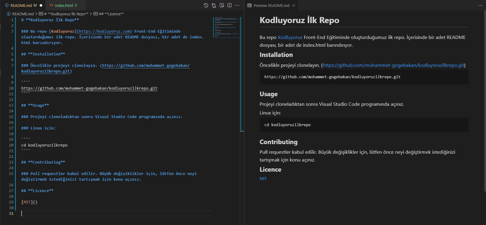

# **Kodluyoruz İlk Repo**

### Bu repo [Kodluyoruz](https://kodluyoruz.com) Front-End Eğitiminde oluşturduğumuz ilk repo. İçerisinde bir adet README dosyası, bir adet de index.html barındırıyor.

## **Installation**

### Öncelikle projeyi clonelayın. (https://github.com/muhammet-gogebakan/kodluyoruzilkrepo.git)

````
https://github.com/muhammet-gogebakan/kodluyoruzilkrepo.git
````

## **Usage**

### Projeyi cloneladıktan sonra Visual Studio Code programında açınız. 

### Linux için:

````
cd kodluyoruzilkrepo
````

## **Contributing**

### Pull requestler kabul edilir. Büyük değişiklikler için, lütfen önce neyi değiştirmek istediğinizi tartışmak için konu açınız.

## **Licence**

[MIT]()

